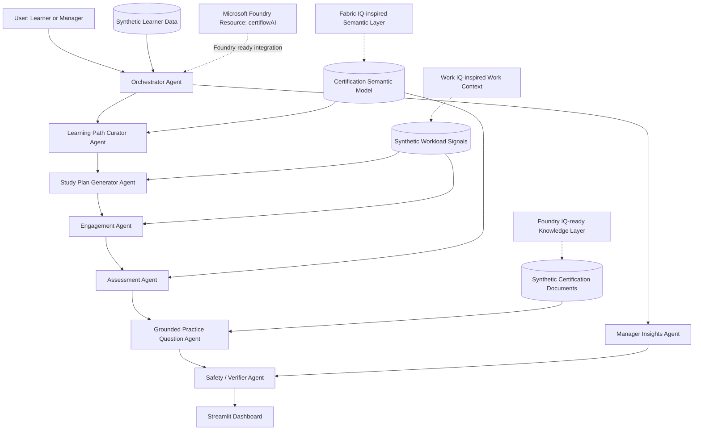

# CertiFlow IQ Architecture

```mermaid
flowchart TD
    U[User: Learner or Manager] --> O[Orchestrator Agent]
    O --> LP[Learning Path Curator Agent]
    LP --> SP[Study Plan Generator Agent]
    SP --> E[Engagement Agent]
    E --> A[Assessment Agent]
    A --> Q[Grounded Practice Question Agent]
    Q --> V[Safety / Verifier Agent]
    O --> M[Manager Insights Agent]
    M --> V
    V --> D[Streamlit Dashboard]

    DATA1[(Synthetic Learner Data)] --> O
    DATA2[(Synthetic Workload Signals)] --> SP
    DATA2 --> E
    DATA3[(Certification Semantic Model)] --> LP
    DATA3 --> A
    DOCS[(Synthetic Certification Documents)] --> Q

    F[Microsoft Foundry Resource: certiflowAI] -. Foundry-ready integration .-> O
    IQ1[Foundry IQ-ready Knowledge Layer] -.-> DOCS
    IQ2[Fabric IQ-inspired Semantic Layer] -.-> DATA3
    IQ3[Work IQ-inspired Work Context] -.-> DATA2
```
